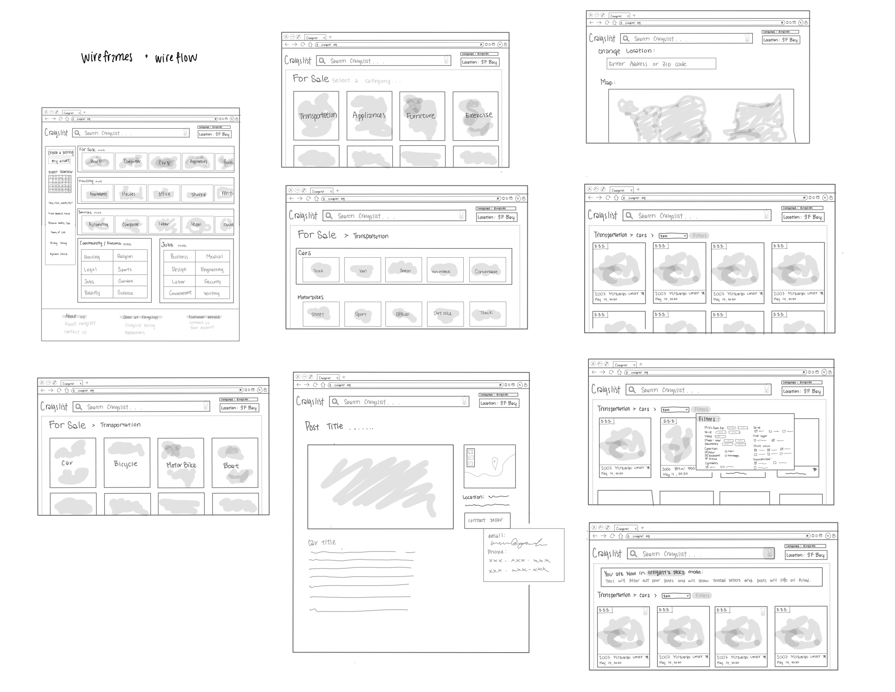
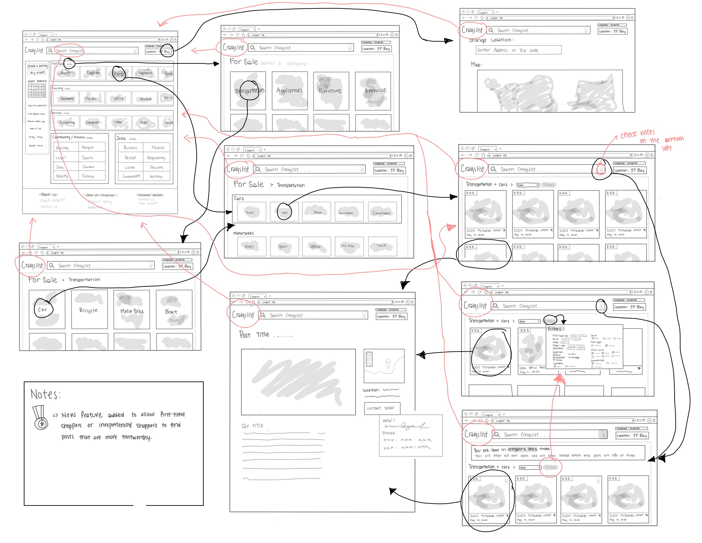
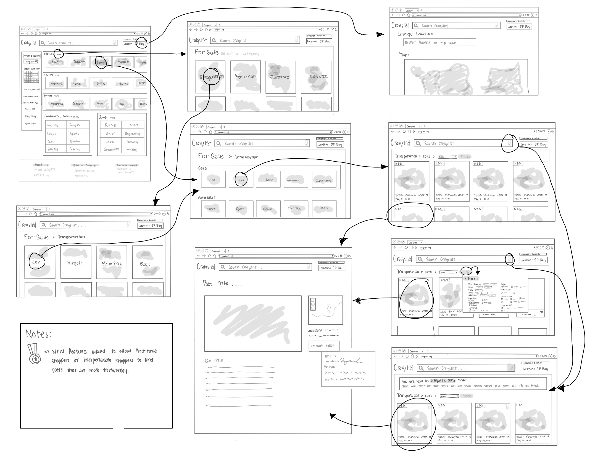
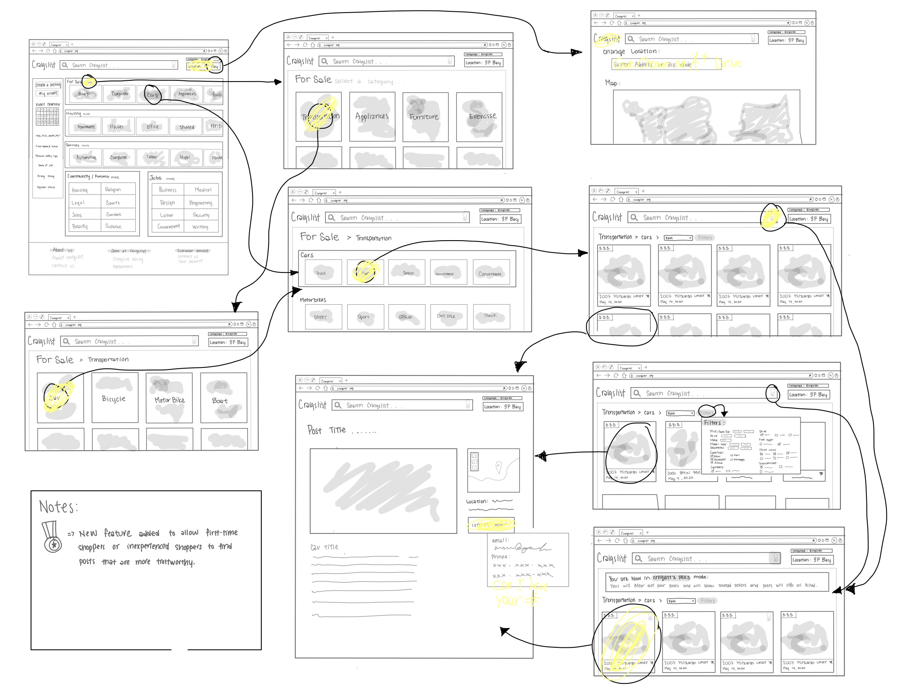

# DH150-Assignment6

# Low-Fidelity Prototyping

For this project, I will be working with the website craigslist. Craigslist is a website that serves as an online marketplace for people to sell or buy items, find jobs, talk on forums, and find housing. Craigslist is mainly known for buying and selling items, so for this project, I will be focusing on improving the buying aspect of this site. 

After placing this website through a heuristic evaluation, usability testing, UX storytelling process, and interface design evaluation, I believe that the site can be improved upon to make buying items in online marketplaces more intuitive and more safe. The site is difficult to use due to the design interface. The website is overwhelming due to the excess amount of words and the bright blue text color. Additionally, the main page has no images to help register the categories immediately, instead the user must scan through all the sections listed in small fine print on the front page. 

In my UX storytelling, I create three personas, Henry Martin, Jennifer Chen, and Daphne Dao. They each had their own concerns and issues with shopping within the site. Henry struggled to filter out all the unwanted posts and wanted the main page to be easier to use and click through. Jennifer had issues concerning the safety and reliability of the sellers. Finally, daphne had problems regarding the functionality of the site and how to contact the seller of the item. 

As a result of my testing, I wanted to improve several features of the site. The first one being, the ability of searching through categories and adding images to improve the recognition of the categories. Next, I wanted to add a function called “Craigslist’s picks” that helps new users and unfamiliar users to filter off incomplete posts and show users that have sold successfully at least once. Finally, I wanted to improve the overall interface design of the site to help users more easily recognize the different functions within the site. 

Therefore, I have created a low-fidelity prototype to demonstrate how these features will be integrated onto the site. I have created wireframes and wireflows to demonstrate the functionality and the flow of the new site. This will show me the thought process of the users when working through the prototype and allow me to make adjustments accordingly. 

## Tasks/ To-Do list :

(1) Click on location

(2) Type in an address or zip code

(3) Click back to the main page

(4) Click ‘more’ next to the ‘For Sale’ to look at different things for sale

(5) Select ‘transportation’ to look through different means of transportation

(6) Select the ‘Van’ picture to look at different vans

(7) Click the ‘Craigslist’s picks’

(8) Then click through filters to select preferences

(9) Select the post you are interested in

(10) Contact seller

## Low-Fidelity Prototype: 

### Original

**Link**: Click here [https://drive.google.com/file/d/19hK_bBZsYS5bh595wMVNabMJeH-QMKyg/view?usp=sharing]

### Revised

**Link**: Click here [https://drive.google.com/file/d/15jNLCwELA11nwOt0D2m19W228wFOzXPt/view?usp=sharing]

## Testing Screen Capture Video:

**Link**: Click here[https://drive.google.com/file/d/1l4OHKrO3gWCV4rmZRiH9yH0knsXZAIUI/view?usp=sharing]

## Testing Images:

**Link**: Click here[https://drive.google.com/file/d/1yg2fcQNP5A2I62ja0g41BTXComa_xH1x/view?usp=sharing]

**Link**: Click here [https://drive.google.com/file/d/1JeQ7GSQ3Q27JThGj7iMNCAnM_f9-S-pq/view?usp=sharing]

## Reflection and Feedback:

During the testing for the low-fidelity prototype, the process went relatively smooth. The user was able to click through the screens and buttons accordingly and with little to no issues. The user followed the arrows that pointed to the screen or section according to what they were ‘click’ on the screen. However, there were several issues while going through the test. 

(1) The first issue came up on step 8 of the to-do list. I was missing an arrow that pointed to the filter pop up screen. This caused the user to become confused, so the user skipped the 8th step. To fix this step in my second version prototype, I added more arrows into the prototype to make sure all buttons were accounted for.

(2)Another issue was when doing the test was step 7, which was the click the ‘Craigslist’s picks’ option. The user was confused as to what this was because this is a new feature I am attempting to integrate into the site. In order to avoid this issue next time, I will need to place a more noticeable disclaimer that explains the new function and I will verbally explain the new feature. When integrating the new function in the site, I will add a disclaimer right under the search bar to let users know the functions of the new feature. 

Overall, the low-fidelity test went more smoothly that I thought it would have. However, that may have been due to the person who was being tested. This user is very familiar with online shopping and online marketplace sites, so I am interested in how others would work through the prototype. 

